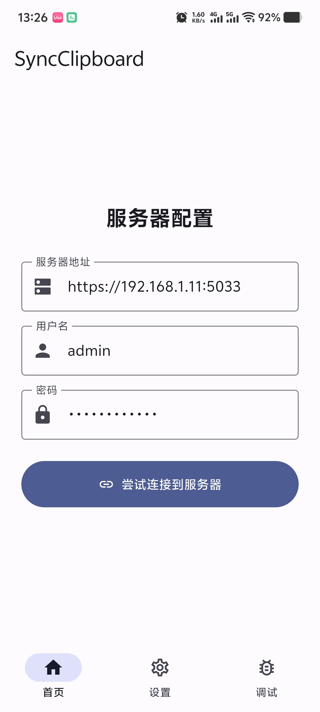
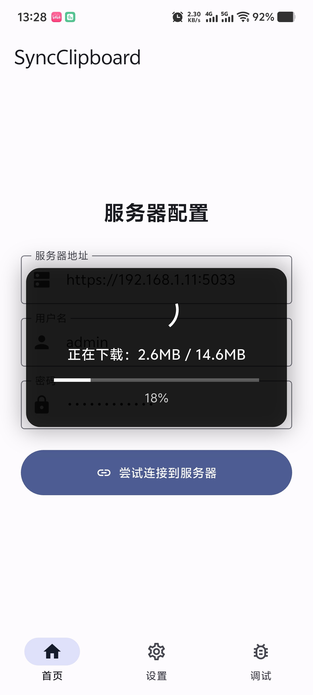

# Sync Clipboard Flutter

## 项目简介

本项目是一个使用 Flutter 构建的 Material 3 风格的安卓客户端应用，作为 [Jeric-X/SyncClipboard](https://github.com/Jeric-X/SyncClipboard) 项目的配套应用，实现跨设备的剪贴板内容同步功能。

## 功能特性

- **剪贴板上传:** 将剪贴板内容上传到 SyncClipboard 服务器
- **剪贴板下载:** 从 SyncClipboard 服务器下载文本并写入到剪贴板
- **文件同步:** 支持单个文件的上传和下载
- **文件组下载:** 支持 group 类型的下载（但是不支持 group 的上传）
- **安卓原生分享:** 支持从其他应用分享文本或文件到本应用进行上传
- **即用即走:** 上传/下载剪贴板以后，将自动退出 app

## 使用步骤

1. 下载最新版本的 [Sync Clipboard Flutter](https://github.com/bling-yshs/sync-clipboard-tauri/releases/latest) 并安装

2. 打开 app，进入设置页面，填写 SyncClipboard 服务器配置（支持 webdav 服务器）

    
    
3. 打开控制中心，添加磁贴「剪贴板上传」与「剪贴板下载」

    
    
4. 点击磁贴开始使用

    

## 项目结构

```
sync-clipboard-flutter/
├── lib/                        # Flutter 源码
│   ├── main.dart               # 应用入口
│   ├── page/                   # 页面组件
│   │   ├── main_page.dart      # 主页面（底部导航）
│   │   ├── home_page.dart      # 首页
│   │   ├── config_page.dart    # 设置页面
│   │   ├── debug_page.dart     # 调试页面
│   │   ├── tile_page.dart      # 磁贴透明页面
│   │   └── share_upload_page.dart  # 分享上传页面
│   ├── model/                  # 数据模型
│   │   ├── app_settings/       # 应用设置
│   │   ├── server_config/      # 服务器配置
│   │   └── clipboard/          # 剪贴板数据
│   ├── router/                 # go_router 路由配置
│   ├── dio/                    # 网络请求客户端
│   └── constants/              # 常量定义
├── android/                    # Android 平台代码
│   └── app/src/main/kotlin/    # Kotlin 原生代码
│       ├── MainActivity.kt
│       ├── TileActionActivity.kt       # 磁贴动作活动
│       ├── UploadClipboardTileService.kt   # 上传磁贴服务
│       └── DownloadClipboardTileService.kt # 下载磁贴服务
└── pubspec.yaml                # Flutter 依赖配置
```

## 开发环境

- Flutter 3.38.3
- Dart SDK ^3.10.1
- Android SDK 21+

## 构建指南

```bash
# 安装依赖
flutter pub get

# 运行开发版本
flutter run

# 构建 ARM64 Release APK
flutter build apk --release --target-platform android-arm64
```

## 许可证

本项目采用 [MIT](LICENSE) 开源许可证。
